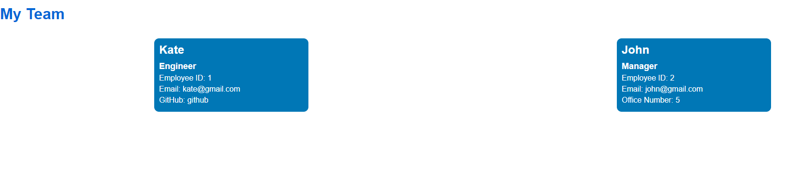

# Team Profile Generator

## Description

This command-line application takes in information about employees on a team and generates an HTML webpage that displays summaries for each person.

## Installation

App uses Jest for running unit tests and Inquirer for collecting input from the user. The application will be invoked by using the following command:

```
node index.js
```

## Usage
- User is presented with a CLI app that accepts user input when running node index.js( npm start)
- When the user starts the application, they are prompted to enter the team member's name, role, and other options related to their role.
- WHEN the user decides to finish building their team, they can choose to end the app and the HTML page will be generated.

 The finished html page will resemble this image:

 
 
## Credits
Many Thanks to the UCR Coding Bootcamp Academic team and my wonderful classmates for supporting me through my coding journey!
## License
N/A
## Link to github repository:
https://github.com/AnaCampos171/Team_Profile_Generator

## Link to a video walkthrough demonstrating app functionality: 
https://drive.google.com/file/d/1Aju18_r_Qjc6hYxTk-3n5Fxc9-lHKcAN/view

